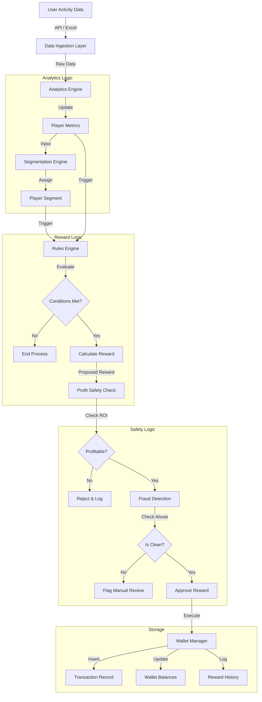

# Data Flow & Logic Documentation

This document details how data moves through the Loyalty System, from input to database persistence, highlighting key logic gates and state changes.

## 1. Overall System Data Flow

---

## 2. Detailed Process Flows

### A. Player Segmentation Flow
**Trigger**: New transaction data (Deposit/Wager) or Scheduled Batch Job.

1.  **Input**:
    *   `total_deposited`
    *   `total_wagered`
    *   `net_pnl` (Won - Wagered)
    *   `days_active`

2.  **Processing (Logic Gates)**:
    *   **Gate 1 (New Player)**: Is `total_wagered < NEW_PLAYER_THRESHOLD` (e.g., $1000)?
        *   *Yes* → Assign `NEW`
        *   *No* → Continue
    *   **Gate 2 (VIP)**: Is `total_wagered > VIP_THRESHOLD` (e.g., $100k)?
        *   *Yes* → Assign `VIP`
    *   **Gate 3 (Profitability)**:
        *   If `net_pnl > 0` (Player is winning) → Assign `WINNING`
        *   If `net_pnl` is near 0 (±5%) → Assign `BREAKEVEN`
        *   Else → Assign `LOSING`

3.  **Output**:
    *   Update `players.segment` field in DB.
    *   Emit event: `PLAYER_SEGMENT_CHANGED` (triggers rule re-evaluation).

---

### B. Reward Rule Evaluation Flow
**Trigger**: Player Event (e.g., "Daily Login", "Deposit Made") or Scheduled "End of Week" Job.

1.  **Fetch Rules**:
    *   Query `reward_rules` table where `is_active = true`.
    *   Filter rules by `trigger_event` matching current event.

2.  **Evaluate Conditions (Per Rule)**:
    *   **JSON Condition**: e.g., `{"segment": "LOSING", "net_loss_min": 100}`
    *   **Check**:
        *   Does player.segment == 'LOSING'?
        *   Is player.metrics.net_pnl <= -100?
    *   *Result*: Pass/Fail.

3.  **Calculation (If Pass)**:
    *   **Formula**: `net_loss * 0.10`
    *   **Computation**: `-(-100) * 0.10 = 10`
    *   **Constraint Check**: Is `10 <= max_amount`?
    *   **Output**: Proposed Reward Object `{type: 'BONUS', amount: 10}`.

---

### C. Profit Safety Gate
**Trigger**: Reward Proposed by Rules Engine.

This is a critical gate to prevent system bankruptcy.

1.  **Calculate Metric: Player LTV Potential**
    *   `Historical Wager Avg` = $500/week (Last 4 weeks)
    *   `Expected Revenue` = $500 * `House Edge` (e.g., 5%) = $25/week.

2.  **Calculate Metric: Reward Cost**
    *   `Proposed Reward` = $10.

3.  **ROI Check**:
    *   `Profit Impact` = $25 (Revenue) - $10 (Cost) = $15.
    *   `Is Positive?` Yes.
    *   **Decision**: **APPROVE**.

    *(Scenario: If proposed reward was $100, Profit Impact = 25 - 100 = -$75. Decision: **REJECT**)*.

---

### D. Transaction & Wallet Update Flow
**Trigger**: Approved Reward.

This step must be **Atomic** (All or Nothing).

1.  **Start Database Transaction**:
    *   `BEGIN TRANSACTION`

2.  **Operation 1: Create Reward History**:
    *   Insert into `reward_history` (`status='COMPLETED'`, `amount=10`).

3.  **Operation 2: Create Wallet Transaction**:
    *   Insert into `transactions` (`type='REWARD'`, `amount=10`, `balance_after=...`).

4.  **Operation 3: Update Balance**:
    *   `UPDATE loyalty_balances SET bonus_balance = bonus_balance + 10 WHERE player_id = ...`

5.  **Operation 4: Update Wagering Requirements** (If Bonus):
    *   `UPDATE loyalty_balances SET bonus_wagering_required = bonus_wagering_required + (10 * 10x_multiplier) ...`

6.  **Commit**:
    *   `COMMIT`
    *   (On Error: `ROLLBACK`).

---

## 3. Data Dictionary (Key Fields)

| Table | Field | Source | Update Frequency | Description |
| :--- | :--- | :--- | :--- | :--- |
| `players` | `segment` | `Analytics Engine` | Daily/Real-time | Current strategic classification of the player. |
| `player_metrics` | `net_pnl` | `Data Importer` | Per Transaction | Net Profit/Loss ($). Negative means player lost money. |
| `player_metrics` | `risk_score` | `Fraud Engine` | Per Event | 0-100 score. 100 = High Risk. |
| `reward_rules` | `conditions` | `Admin` | Manual | JSON Logic defining who gets the reward. |
| `loyalty_balances` | `bonus_balance` | `Wallet Manager` | Per Transaction | Locked funds requiring wagering before withdrawal. |
