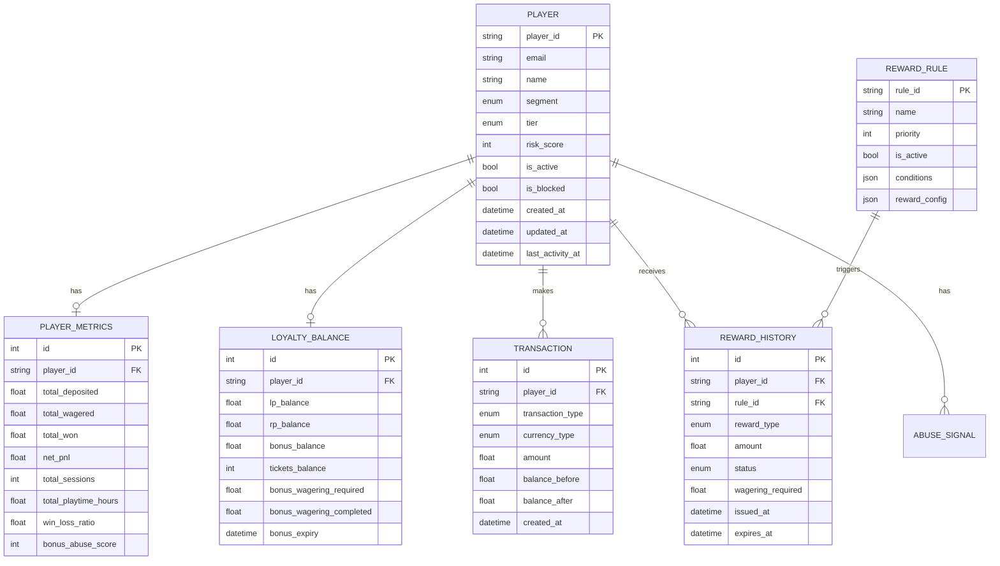

# Database Schema Documentation

## Overview

The loyalty program uses PostgreSQL with SQLAlchemy ORM. The schema is designed for scalability, data integrity, and comprehensive audit trails.

## Entity Relationship Diagram



## Tables

### 1. players

**Purpose**: Core player profile and status

| Column | Type | Description |
|--------|------|-------------|
| player_id | VARCHAR(50) PK | Unique player identifier |
| email | VARCHAR(255) | Player email (unique) |
| name | VARCHAR(255) | Player name |
| segment | ENUM | Player segment (NEW, WINNING, BREAKEVEN, LOSING, VIP) |
| tier | ENUM | Loyalty tier (BRONZE, SILVER, GOLD, PLATINUM) |
| risk_score | INTEGER | Risk score 0-100 |
| is_active | BOOLEAN | Active status |
| is_blocked | BOOLEAN | Blocked status |
| created_at | TIMESTAMP | Creation timestamp |
| updated_at | TIMESTAMP | Last update timestamp |
| last_activity_at | TIMESTAMP | Last activity timestamp |

**Indexes**:
- `idx_player_segment_tier` on (segment, tier)

---

### 2. player_metrics

**Purpose**: Player financial, behavioral, and risk metrics

| Column | Type | Description |
|--------|------|-------------|
| id | INTEGER PK | Auto-increment ID |
| player_id | VARCHAR(50) FK | References players.player_id |
| total_deposited | FLOAT | Total amount deposited |
| total_wagered | FLOAT | Total amount wagered |
| total_won | FLOAT | Total amount won |
| net_pnl | FLOAT | Net profit/loss (won - deposited) |
| house_edge_contribution | FLOAT | Amount lost to house |
| total_sessions | INTEGER | Number of sessions |
| total_playtime_hours | FLOAT | Total playtime in hours |
| avg_session_duration | FLOAT | Average session duration |
| total_bets | INTEGER | Total number of bets |
| avg_bet_size | FLOAT | Average bet size |
| games_played | JSON | Games played breakdown |
| win_loss_ratio | FLOAT | Win/loss ratio |
| volatility_score | FLOAT | Betting volatility |
| bonus_abuse_score | INTEGER | Abuse score 0-100 |
| last_deposit_at | TIMESTAMP | Last deposit timestamp |
| last_wager_at | TIMESTAMP | Last wager timestamp |

---

### 3. loyalty_balances

**Purpose**: Multi-currency wallet with restrictions

| Column | Type | Description |
|--------|------|-------------|
| id | INTEGER PK | Auto-increment ID |
| player_id | VARCHAR(50) FK | References players.player_id |
| lp_balance | FLOAT | Loyalty Points balance |
| rp_balance | FLOAT | Reward Points balance |
| bonus_balance | FLOAT | Bonus money balance |
| tickets_balance | INTEGER | Tickets balance |
| bonus_wagering_required | FLOAT | Total wagering required |
| bonus_wagering_completed | FLOAT | Wagering completed |
| bonus_expiry | TIMESTAMP | Bonus expiry date |
| bonus_max_bet | FLOAT | Max bet with bonus |
| bonus_eligible_games | JSON | Eligible games list |

**Constraints**:
- CHECK: All balances >= 0

---

### 4. tiers

**Purpose**: Tier configuration

| Column | Type | Description |
|--------|------|-------------|
| id | INTEGER PK | Auto-increment ID |
| tier_level | ENUM | Tier level (unique) |
| lp_min | INTEGER | Minimum LP required |
| lp_max | INTEGER | Maximum LP (nullable) |
| benefits | JSON | Tier benefits configuration |

---

### 5. reward_rules

**Purpose**: Configurable reward rules

| Column | Type | Description |
|--------|------|-------------|
| rule_id | VARCHAR(100) PK | Unique rule identifier |
| name | VARCHAR(255) | Rule name |
| description | VARCHAR(500) | Rule description |
| priority | INTEGER | Evaluation priority (higher first) |
| is_active | BOOLEAN | Active status |
| conditions | JSON | Rule conditions |
| reward_config | JSON | Reward configuration |
| created_at | TIMESTAMP | Creation timestamp |
| updated_at | TIMESTAMP | Last update timestamp |

**Indexes**:
- `idx_rule_priority_active` on (priority, is_active)

**Example JSON structures**:

```json
// conditions
{
  "segment": "LOSING",
  "net_loss_min": 100,
  "session_count_min": 3,
  "days_since_last_deposit": {"max": 7}
}

// reward_config
{
  "type": "BONUS_BALANCE",
  "formula": "net_loss * 0.10",
  "max_amount": 500,
  "wagering_requirement": 10,
  "expiry_hours": 48,
  "eligible_games": ["slots", "roulette"]
}
```

---

### 6. transactions

**Purpose**: Complete audit trail of all balance changes

| Column | Type | Description |
|--------|------|-------------|
| id | INTEGER PK | Auto-increment ID |
| player_id | VARCHAR(50) FK | References players.player_id |
| transaction_type | ENUM | Type (DEPOSIT, WAGER, WIN, REWARD, etc.) |
| currency_type | ENUM | Currency (LP, RP, BONUS, TICKETS) |
| amount | FLOAT | Transaction amount |
| balance_before | FLOAT | Balance before transaction |
| balance_after | FLOAT | Balance after transaction |
| description | VARCHAR(500) | Description |
| reference_id | VARCHAR(100) | External reference |
| metadata | JSON | Additional metadata |
| created_at | TIMESTAMP | Transaction timestamp |

**Indexes**:
- `idx_transaction_player_date` on (player_id, created_at)

---

### 7. reward_history

**Purpose**: Track all rewards issued

| Column | Type | Description |
|--------|------|-------------|
| id | INTEGER PK | Auto-increment ID |
| player_id | VARCHAR(50) FK | References players.player_id |
| rule_id | VARCHAR(100) FK | References reward_rules.rule_id |
| reward_type | ENUM | Reward type |
| amount | FLOAT | Reward amount |
| currency_type | ENUM | Currency type |
| status | ENUM | Status (PENDING, ACTIVE, COMPLETED, EXPIRED) |
| wagering_required | FLOAT | Wagering requirement |
| wagering_completed | FLOAT | Wagering completed |
| issued_at | TIMESTAMP | Issue timestamp |
| expires_at | TIMESTAMP | Expiry timestamp |
| completed_at | TIMESTAMP | Completion timestamp |
| metadata | JSON | Additional metadata |

**Indexes**:
- `idx_reward_player_status` on (player_id, status)

---

### 8. abuse_signals

**Purpose**: Fraud and abuse detection

| Column | Type | Description |
|--------|------|-------------|
| id | INTEGER PK | Auto-increment ID |
| player_id | VARCHAR(50) FK | References players.player_id |
| signal_type | VARCHAR(100) | Signal type |
| severity | INTEGER | Severity 1-10 |
| description | VARCHAR(500) | Description |
| metadata | JSON | Additional metadata |
| is_resolved | BOOLEAN | Resolution status |
| resolved_at | TIMESTAMP | Resolution timestamp |
| detected_at | TIMESTAMP | Detection timestamp |

**Indexes**:
- `idx_abuse_player_unresolved` on (player_id, is_resolved)

---

## Enums

### PlayerSegment
- `NEW` - New player with low activity
- `WINNING` - Profitable player
- `BREAKEVEN` - Neutral P&L
- `LOSING` - Negative P&L
- `VIP` - High volume player

### TierLevel
- `BRONZE` - Entry tier
- `SILVER` - Mid tier
- `GOLD` - High tier
- `PLATINUM` - Premium tier

### CurrencyType
- `LP` - Loyalty Points
- `RP` - Reward Points
- `BONUS` - Bonus Balance
- `TICKETS` - Tickets

### TransactionType
- `DEPOSIT` - Real money deposit
- `WITHDRAWAL` - Real money withdrawal
- `WAGER` - Bet placed
- `WIN` - Win payout
- `REWARD` - Reward issued
- `BONUS_ISSUED` - Bonus added
- `BONUS_EXPIRED` - Bonus expired
- `LP_EARNED` - LP earned
- `LP_REDEEMED` - LP redeemed

### RewardType
- `CASHBACK` - Cashback reward
- `BONUS_BALANCE` - Bonus money
- `FREE_PLAY` - Free play
- `LOYALTY_POINTS` - LP reward
- `REWARD_POINTS` - RP reward
- `TICKETS` - Ticket reward
- `VIP_PERKS` - VIP benefits

### RewardStatus
- `PENDING` - Not yet issued
- `ACTIVE` - Active and usable
- `COMPLETED` - Wagering completed
- `EXPIRED` - Expired
- `CANCELLED` - Cancelled

---

## Database Initialization

```python
from database import init_db

# Create all tables
init_db()
```

## Migration Strategy

For production deployments, use Alembic for database migrations:

```bash
# Initialize Alembic
alembic init alembic

# Create migration
alembic revision --autogenerate -m "Initial schema"

# Apply migration
alembic upgrade head
```

---

## Performance Considerations

1. **Indexes**: All foreign keys and frequently queried fields are indexed
2. **Partitioning**: Consider partitioning `transactions` table by date for large datasets
3. **Archiving**: Archive old transactions and rewards to separate tables
4. **Caching**: Cache player metrics and balances in Redis for high-traffic scenarios
