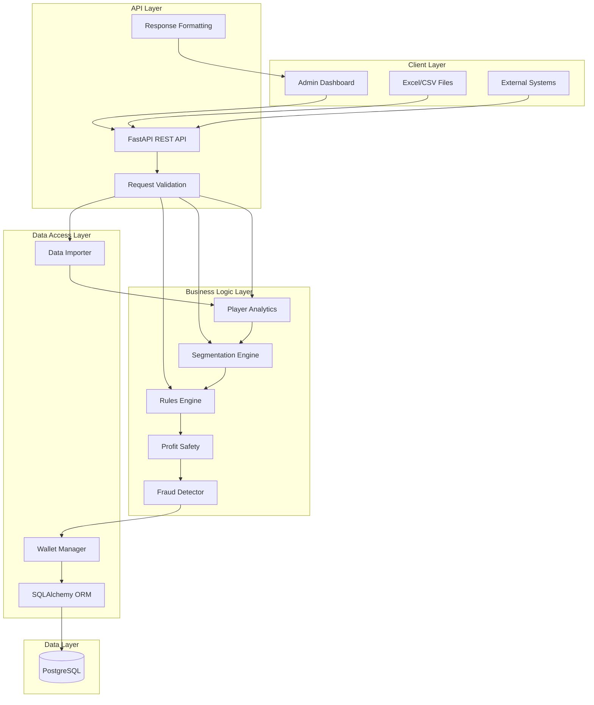
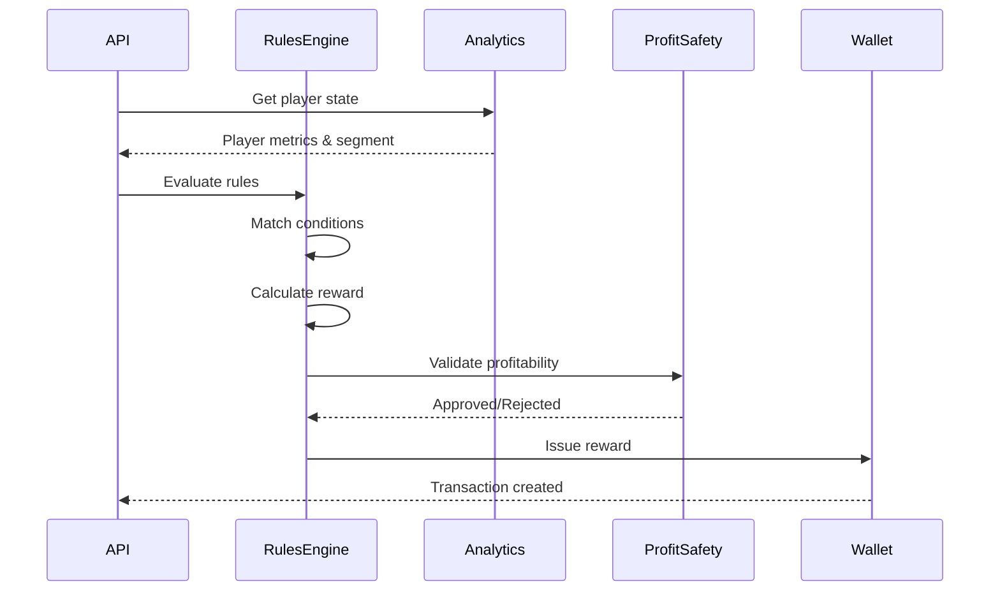
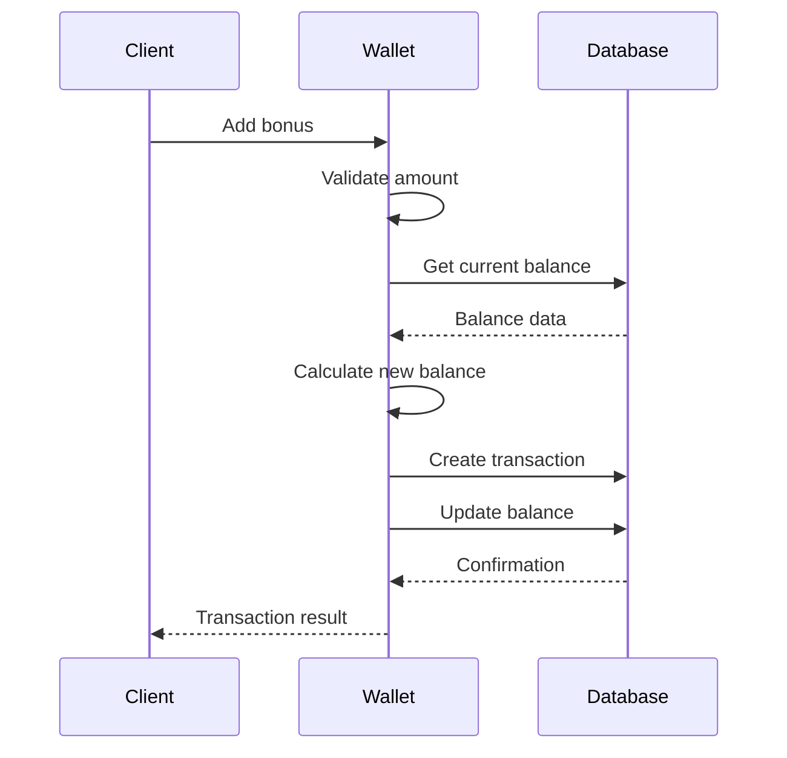
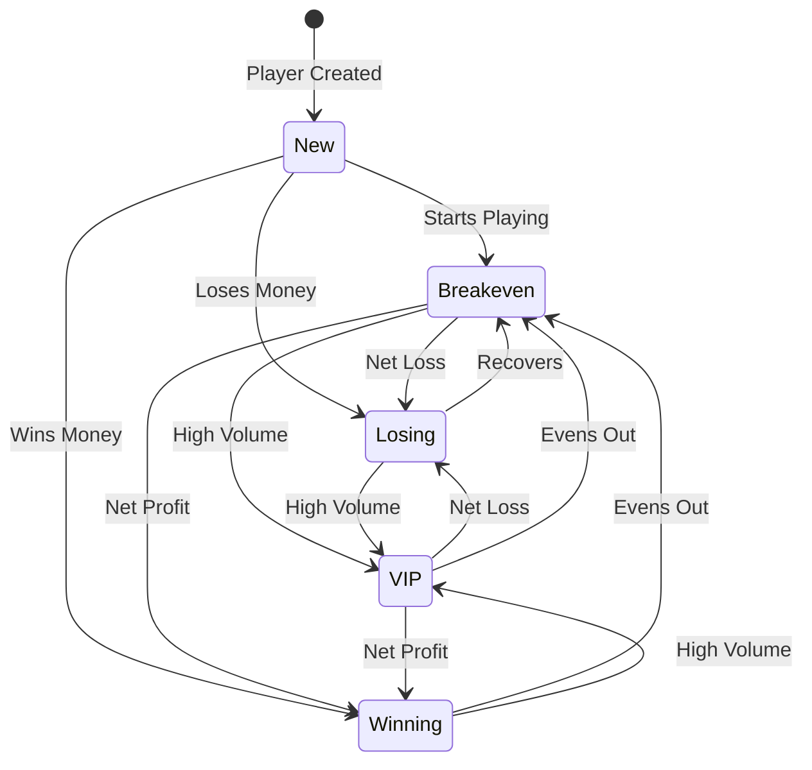
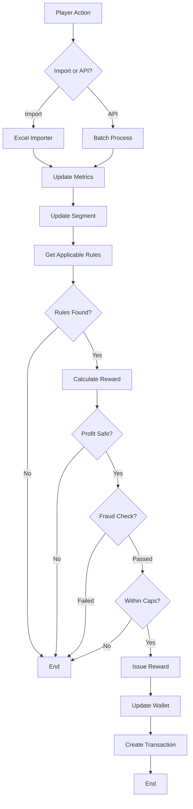

# System Architecture

## High-Level Architecture



## Component Architecture

### 1. API Layer

**Technology**: FastAPI with Pydantic

**Responsibilities**:
- HTTP request handling
- Input validation
- Authentication/authorization (future)
- Response formatting
- Error handling
- OpenAPI documentation

**Key Files**:
- `main.py` - FastAPI application
- `api/admin_api.py` - Admin endpoints
- `api/schemas.py` - Pydantic schemas

---

### 2. Analytics Layer

**Components**:
- **Player Analytics** (`analytics/player_analytics.py`)
  - Financial metrics calculation
  - Behavioral metrics tracking
  - Risk assessment
  - Player state aggregation

- **Segmentation** (`analytics/segmentation.py`)
  - Dynamic player classification
  - Segment distribution analysis
  - Batch reclassification

**Data Flow**:
```
Transaction Data → Analytics Engine → Metrics → Segmentation → Player State
```

---

### 3. Rules Engine Layer

**Component**: `engine/rules_engine.py`

**Responsibilities**:
- Rule condition evaluation
- Reward amount calculation
- Formula parsing and execution
- Priority-based rule matching
- Reward creation

**Rule Evaluation Flow**:


---

### 4. Safety Layer

**Components**:

- **Profit Safety** (`safety/profit_safety.py`)
  - Expected value calculations
  - ROI validation
  - Reward cap enforcement
  - House edge consideration

- **Fraud Detector** (`safety/fraud_detector.py`)
  - Abuse pattern detection
  - Risk scoring
  - Automated penalties
  - Manual review flagging

**Safety Flow**:
```
Reward Request → Profit Check → Fraud Check → Caps Check → Approve/Reject
```

---

### 5. Wallet Layer

**Component**: `wallet/wallet_manager.py`

**Responsibilities**:
- Multi-currency balance management
- Transaction processing
- Wagering requirement tracking
- Bonus restrictions enforcement
- Expiry management

**Transaction Flow**:


---

### 6. Data Import Layer

**Component**: `data/excel_importer.py`

**Responsibilities**:
- Excel/CSV file parsing
- Data validation
- Batch player processing
- Automatic metric updates
- Automatic reward triggering

**Import Flow**:
```
Excel Upload → Validation → Player Creation/Update → Metrics Calculation → 
Segmentation → Rule Evaluation → Reward Issuance
```

---

## Data Flow Diagrams

### Player Lifecycle



### Reward Processing



---

## Scalability Considerations

### Horizontal Scaling

1. **API Layer**: Stateless, can run multiple instances behind load balancer
2. **Database**: PostgreSQL with read replicas for analytics queries
3. **Caching**: Redis for frequently accessed player data

### Vertical Scaling

1. **Database Optimization**:
   - Proper indexing on all foreign keys
   - Partitioning large tables (transactions, rewards)
   - Regular VACUUM and ANALYZE

2. **Query Optimization**:
   - Eager loading for relationships
   - Batch operations for bulk processing
   - Connection pooling

### Performance Targets

- API Response Time: < 200ms (p95)
- Rule Evaluation: < 100ms per player
- Batch Import: 1000 players/minute
- Database Queries: < 50ms (p95)

---

## Security Architecture

### Current Implementation

- Input validation via Pydantic
- SQL injection prevention via SQLAlchemy ORM
- Environment-based configuration

### Future Enhancements

1. **Authentication**:
   - JWT token-based auth
   - Role-based access control (Admin, Operator, Viewer)

2. **Authorization**:
   - API key management
   - IP whitelisting
   - Rate limiting

3. **Data Security**:
   - Encryption at rest
   - Encryption in transit (HTTPS)
   - PII data masking in logs

---

## Monitoring & Observability

### Recommended Stack

1. **Logging**: Structured logging with JSON format
2. **Metrics**: Prometheus + Grafana
3. **Tracing**: OpenTelemetry
4. **Alerting**: PagerDuty or similar

### Key Metrics to Monitor

- API request rate and latency
- Rule evaluation success/failure rate
- Reward issuance rate
- Fraud detection alerts
- Database connection pool usage
- Transaction processing time

---

## Deployment Architecture

### Development

```
Local Machine
├── PostgreSQL (Docker or local)
├── Python FastAPI app
└── Sample data
```

### Production (Recommended)

```
Cloud Provider (AWS/GCP/Azure)
├── Load Balancer
├── API Servers (Auto-scaling group)
│   └── FastAPI containers (Docker/Kubernetes)
├── Database
│   ├── Primary PostgreSQL (RDS/Cloud SQL)
│   └── Read Replicas
├── Cache Layer
│   └── Redis (ElastiCache/Memorystore)
└── Object Storage
    └── Excel file uploads (S3/GCS)
```

---

## Technology Stack

| Layer | Technology | Purpose |
|-------|-----------|---------|
| API Framework | FastAPI | REST API with auto-docs |
| ORM | SQLAlchemy | Database abstraction |
| Database | PostgreSQL | Primary data store |
| Validation | Pydantic | Request/response validation |
| Data Processing | Pandas | Excel/CSV processing |
| Server | Uvicorn | ASGI server |
| Testing | Pytest | Unit/integration tests |

---

## Design Patterns Used

1. **Repository Pattern**: Data access abstraction
2. **Service Layer**: Business logic separation
3. **Factory Pattern**: Model creation
4. **Strategy Pattern**: Rule evaluation
5. **Observer Pattern**: Event-driven updates (future)

---

## Future Architecture Enhancements

1. **Event-Driven Architecture**:
   - Kafka/RabbitMQ for real-time events
   - Event sourcing for audit trail
   - CQRS for read/write separation

2. **Microservices**:
   - Separate services for analytics, rules, wallet
   - API Gateway for routing
   - Service mesh for inter-service communication

3. **Machine Learning Integration**:
   - Churn prediction model
   - Fraud detection ML model
   - Personalized reward recommendations

4. **Real-Time Processing**:
   - Stream processing for live events
   - Real-time dashboards
   - Instant reward issuance
