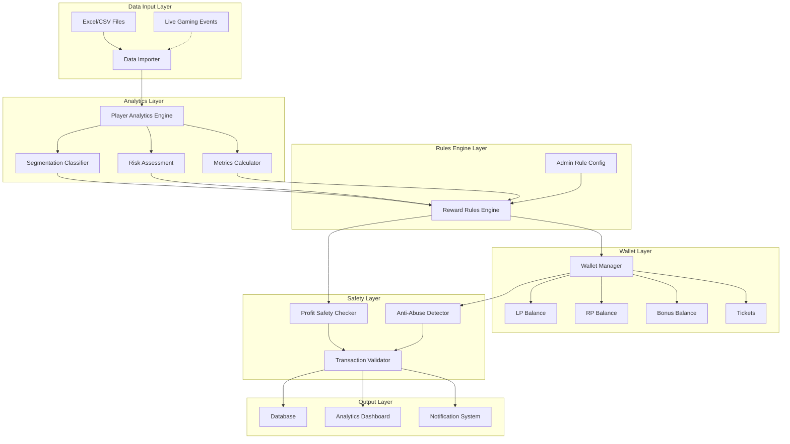

# Gaming Loyalty & Reward Program - Implementation Plan

A scalable, customizable, profit-safe loyalty and reward system for gaming platforms that increases player LTV, reduces churn, and ensures platform profitability.

## User Review Required

> [!IMPORTANT]
> **Technology Stack Confirmation**
> - **Backend**: Python 3.10+ with FastAPI for REST APIs
> - **Database**: PostgreSQL for relational data (players, transactions, rules)
> - **Data Processing**: Pandas for Excel/CSV processing
> - **Admin Interface**: Will you need a web-based admin panel (React/Next.js) or CLI-based management?
> - **Deployment**: Local development initially, or cloud-ready (Docker)?

> [!IMPORTANT]
> **Data Source Clarification**
> You mentioned player data comes from Excel sheets. Please confirm:
> - Will the system integrate with live gaming platform APIs, or is it purely Excel-based batch processing?
> - Should the system support real-time event streaming (bets, wins, losses) or periodic batch updates?
> - Do you have sample Excel files with player data structure?

> [!WARNING]
> **Compliance & Legal**
> - Gaming regulations vary by jurisdiction (India, US, EU, etc.)
> - This implementation focuses on technical architecture
> - Legal review required before production deployment
> - KYC/AML integration may be needed depending on region

## Proposed Changes

### Core System Architecture



---

### Component 1: Database Schema & Models

#### [NEW] [models.py](file:///Users/rakshitjangid/Documents/AyursInfoTech/Loyalty_Reward_program/models.py)

Complete SQLAlchemy models for:
- **Player**: Core player profile with tier, segment, risk score
- **PlayerMetrics**: Financial and behavioral metrics (deposits, wagers, P&L, sessions)
- **LoyaltyBalance**: Multi-currency wallet (LP, RP, Bonus, Tickets)
- **Tier**: Configurable tier system with benefits
- **RewardRule**: JSON-based rule definitions with conditions
- **Transaction**: Complete audit trail of all balance changes
- **RewardHistory**: Track all rewards issued and their status
- **AbuseSignal**: Fraud detection signals

**Key Design Decisions**:
- Separate tables for metrics vs balances for query performance
- JSON fields for flexible rule conditions (PostgreSQL JSONB)
- Enum types for player segments, reward types, transaction types
- Timestamps and audit fields on all tables
- Indexes on frequently queried fields (player_id, segment, tier)

---

### Component 2: Player Analytics Engine

#### [NEW] [analytics/player_analytics.py](file:///Users/rakshitjangid/Documents/AyursInfoTech/Loyalty_Reward_program/analytics/player_analytics.py)

**Responsibilities**:
- Calculate financial metrics (total deposited, wagered, won, net P&L)
- Track behavioral metrics (sessions, playtime, bet frequency, game diversity)
- Compute risk metrics (win/loss ratio, volatility, bonus abuse score)
- Update player metrics from Excel data or live events

**Key Functions**:
- `calculate_financial_metrics(player_id, transactions)` → Financial metrics
- `calculate_behavioral_metrics(player_id, sessions)` → Behavioral metrics
- `calculate_risk_score(player_id)` → Risk score (0-100)
- `update_player_metrics(player_id)` → Refresh all metrics

---

### Component 3: Player Segmentation Classifier

#### [NEW] [analytics/segmentation.py](file:///Users/rakshitjangid/Documents/AyursInfoTech/Loyalty_Reward_program/analytics/segmentation.py)

**Responsibilities**:
- Classify players into segments: Winning, Breakeven, Losing, New, VIP
- Dynamic re-segmentation based on updated metrics
- Segment-specific thresholds (configurable)

**Segmentation Logic**:
```python
if total_wagered < 1000:
    segment = "NEW"
elif total_wagered > 100000 and sessions > 100:
    segment = "VIP"
elif net_pnl > 0 and win_loss_ratio > 1.1:
    segment = "WINNING"
elif abs(net_pnl) < (total_wagered * 0.05):
    segment = "BREAKEVEN"
else:
    segment = "LOSING"
```

**Key Functions**:
- `classify_player(player_id)` → Segment enum
- `get_segment_thresholds()` → Configurable thresholds
- `batch_reclassify_players()` → Bulk segment updates

---

### Component 4: Reward Rules Engine

#### [NEW] [engine/rules_engine.py](file:///Users/rakshitjangid/Documents/AyursInfoTech/Loyalty_Reward_program/engine/rules_engine.py)

**Responsibilities**:
- Evaluate JSON-based reward rules against player state
- Calculate reward amounts based on rule formulas
- Apply wagering requirements and caps
- Handle rule priority and conflicts

**Rule Structure** (JSON):
```json
{
  "rule_id": "LOSING_PLAYER_CASHBACK",
  "priority": 10,
  "conditions": {
    "segment": "LOSING",
    "net_loss_min": 100,
    "session_count_min": 3,
    "days_since_last_deposit": {"max": 7}
  },
  "reward": {
    "type": "BONUS_BALANCE",
    "formula": "net_loss * 0.10",
    "max_amount": 500,
    "wagering_requirement": 10,
    "expiry_hours": 48,
    "eligible_games": ["slots", "roulette"]
  }
}
```

**Key Functions**:
- `evaluate_rule(rule, player_state)` → Boolean (rule matches)
- `calculate_reward(rule, player_state)` → Reward amount
- `apply_reward(player_id, rule)` → Create transaction
- `get_applicable_rules(player_id)` → List of matching rules

---

### Component 5: Wallet & Balance Manager

#### [NEW] [wallet/wallet_manager.py](file:///Users/rakshitjangid/Documents/AyursInfoTech/Loyalty_Reward_program/wallet/wallet_manager.py)

**Responsibilities**:
- Manage multi-currency balances (LP, RP, Bonus, Tickets)
- Enforce wagering requirements on bonus balances
- Handle balance locks, expiry, and caps
- Process deposits, withdrawals, rewards, wagers

**Key Features**:
- **Bonus Balance Restrictions**: Track wagering progress, max bet limits, eligible games
- **Expiry Management**: Auto-expire bonuses and tickets
- **Transaction Atomicity**: All balance changes in database transactions
- **Audit Trail**: Complete transaction history

**Key Functions**:
- `add_loyalty_points(player_id, amount, source)` → Transaction
- `add_bonus_balance(player_id, amount, wagering_req, expiry)` → Transaction
- `deduct_balance(player_id, currency, amount)` → Transaction
- `check_wagering_progress(player_id, bonus_id)` → Progress %
- `expire_bonuses()` → Batch expiry job

---

### Component 6: Profit Safety Checker

#### [NEW] [safety/profit_safety.py](file:///Users/rakshitjangid/Documents/AyursInfoTech/Loyalty_Reward_program/safety/profit_safety.py)

**Responsibilities**:
- Validate reward cost vs expected future revenue
- Enforce daily/weekly/monthly reward caps
- Calculate expected value (EV) of rewards
- Block unprofitable reward issuance

**Profit Safety Formula**:
```
Expected Reward Cost < Expected Future Wager Margin

Where:
- Expected Future Wager = Historical Avg Wager * Retention Multiplier
- Expected Margin = Future Wager * House Edge
- Retention Multiplier = f(segment, reward type)
```

**Key Functions**:
- `validate_reward_profitability(player_id, reward_amount)` → Boolean
- `calculate_expected_value(player_id, reward)` → EV
- `check_reward_caps(player_id, reward_type)` → Remaining cap
- `get_house_edge(game_type)` → House edge %

---

### Component 7: Anti-Abuse & Fraud Detection

#### [NEW] [safety/fraud_detector.py](file:///Users/rakshitjangid/Documents/AyursInfoTech/Loyalty_Reward_program/safety/fraud_detector.py)

**Responsibilities**:
- Detect bonus abuse patterns
- Identify multi-accounting (same IP/device)
- Flag suspicious withdrawal patterns
- Auto-adjust reward multipliers for risky players

**Detection Signals**:
- Bonus-only play (no real money deposits after bonus)
- Immediate withdrawal attempts post-bonus
- Bet size manipulation (min bet during wagering)
- Multiple accounts from same IP/device
- Abnormal win rates

**Key Functions**:
- `detect_abuse_signals(player_id)` → List of signals
- `calculate_abuse_score(player_id)` → Score (0-100)
- `apply_abuse_penalty(player_id)` → Reduce reward multiplier
- `flag_for_review(player_id, reason)` → Manual review queue

---

### Component 8: Data Import & Processing

#### [NEW] [data/excel_importer.py](file:///Users/rakshitjangid/Documents/AyursInfoTech/Loyalty_Reward_program/data/excel_importer.py)

**Responsibilities**:
- Import player data from Excel/CSV files
- Validate data format and completeness
- Update player metrics and balances
- Trigger reward rule evaluation

**Expected Excel Format**:
```
player_id | total_deposited | total_wagered | total_won | sessions | playtime_hours | last_deposit_date
P001      | 5000           | 15000         | 12000     | 25       | 48             | 2025-12-20
```

**Key Functions**:
- `import_player_data(file_path)` → Import summary
- `validate_excel_format(df)` → Validation errors
- `process_player_batch(players)` → Batch processing
- `trigger_reward_evaluation(player_ids)` → Evaluate rules

---

### Component 9: Admin CRUD APIs

#### [NEW] [api/admin_api.py](file:///Users/rakshitjangid/Documents/AyursInfoTech/Loyalty_Reward_program/api/admin_api.py)

FastAPI endpoints for admin operations:

**Player Management**:
- `GET /api/players` → List all players with filters
- `GET /api/players/{player_id}` → Player details
- `PUT /api/players/{player_id}` → Update player
- `DELETE /api/players/{player_id}` → Soft delete player

**Reward Rules Management**:
- `GET /api/rules` → List all reward rules
- `POST /api/rules` → Create new rule
- `PUT /api/rules/{rule_id}` → Update rule
- `DELETE /api/rules/{rule_id}` → Delete rule
- `POST /api/rules/{rule_id}/test` → Test rule against player

**Tier Management**:
- `GET /api/tiers` → List all tiers
- `POST /api/tiers` → Create tier
- `PUT /api/tiers/{tier_id}` → Update tier

**Analytics**:
- `GET /api/analytics/dashboard` → Key metrics
- `GET /api/analytics/roi` → ROI by segment/rule
- `GET /api/analytics/churn` → Churn prediction

**Data Import**:
- `POST /api/import/excel` → Upload Excel file
- `GET /api/import/status/{job_id}` → Import job status

---

### Component 10: Analytics & Reporting

#### [NEW] [analytics/reporting.py](file:///Users/rakshitjangid/Documents/AyursInfoTech/Loyalty_Reward_program/analytics/reporting.py)

**Responsibilities**:
- Calculate ROI for each reward rule
- Track reward cost vs incremental revenue
- Player retention analysis
- Churn prediction model
- Segment performance comparison

**Key Metrics**:
- **Reward Cost**: Total bonus/LP/RP issued
- **Incremental Wager**: Additional wagers driven by rewards
- **Retention Rate**: % players active after reward
- **Churn Reduction**: % reduction in churn
- **Net Revenue Impact**: (Incremental Margin - Reward Cost)

**Key Functions**:
- `calculate_rule_roi(rule_id, date_range)` → ROI %
- `get_segment_performance(segment)` → Metrics by segment
- `predict_churn(player_id)` → Churn probability
- `generate_profit_report(date_range)` → Profit analysis

---

## Project Structure

```
Loyalty_Reward_program/
├── models.py                    # SQLAlchemy models
├── database.py                  # Database connection & session
├── config.py                    # Configuration settings
├── main.py                      # FastAPI application entry
│
├── analytics/
│   ├── __init__.py
│   ├── player_analytics.py      # Metrics calculation
│   ├── segmentation.py          # Player segmentation
│   └── reporting.py             # ROI & analytics
│
├── engine/
│   ├── __init__.py
│   └── rules_engine.py          # Reward rules evaluation
│
├── wallet/
│   ├── __init__.py
│   └── wallet_manager.py        # Balance management
│
├── safety/
│   ├── __init__.py
│   ├── profit_safety.py         # Profit validation
│   └── fraud_detector.py        # Abuse detection
│
├── data/
│   ├── __init__.py
│   └── excel_importer.py        # Excel/CSV import
│
├── api/
│   ├── __init__.py
│   ├── admin_api.py             # Admin CRUD endpoints
│   └── schemas.py               # Pydantic schemas
│
├── tests/
│   ├── test_analytics.py
│   ├── test_rules_engine.py
│   ├── test_wallet.py
│   └── test_safety.py
│
├── requirements.txt
├── .env.example
└── README.md
```

---

## Verification Plan

### Automated Tests

1. **Unit Tests**:
   ```bash
   pytest tests/test_analytics.py -v
   pytest tests/test_rules_engine.py -v
   pytest tests/test_wallet.py -v
   pytest tests/test_safety.py -v
   ```

2. **Integration Tests**:
   - End-to-end player data import → segmentation → reward evaluation → wallet update
   - Rule evaluation with various player states
   - Profit safety validation with edge cases

3. **Performance Tests**:
   - Batch processing 10,000 players
   - Rule evaluation latency (< 100ms per player)
   - Database query optimization

### Manual Verification

1. **Excel Import Test**:
   - Prepare sample Excel with 100 players across all segments
   - Import and verify correct segmentation
   - Verify reward rules trigger correctly

2. **Profit Safety Test**:
   - Create unprofitable reward scenario
   - Verify system blocks reward issuance
   - Check logs for safety violations

3. **Fraud Detection Test**:
   - Simulate bonus abuse patterns
   - Verify abuse signals are detected
   - Confirm automated penalties apply

4. **Admin Panel Test** (if web UI built):
   - Create/update/delete reward rules
   - View player analytics dashboard
   - Generate ROI reports

---

## Next Steps After Approval

1. Set up PostgreSQL database and create schema
2. Implement core models and database layer
3. Build player analytics engine
4. Implement reward rules engine
5. Create wallet manager with safety checks
6. Build Excel importer
7. Develop FastAPI admin endpoints
8. Create comprehensive test suite
9. Build analytics dashboard (optional web UI)
10. Documentation and deployment guide
